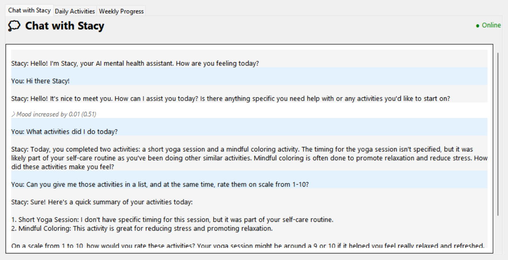

# AI Healthcare Assistant



## My Idea: AI-Powered Mental Health App

Problem: Mental health issues are often overlooked due to stigma or lack of awareness.<br>
Solution: Build an AI-powered mental health assistant that uses NLP to analyze user input and detect signs of stress, anxiety, or depression. It could provide helpful resources, suggest mindfulness activities, or even escalate severe cases to a trusted contact or hotline.<br>

Features:<br>
- Chat interface for users to express feelings.
- Sentiment analysis and mood tracking.
- Personalized activity recommendations based on mental state.
- Weekly progress reports.
- Innovation: Integrate gamification (e.g., users earn points for completing mindfulness tasks) to encourage usage.

The AI will also be able to tap into the logging data, to personize your chat experience. What this means is, when you log some data in the app, you will then be able to ask the AI things like: "What activities have I done today?" Or "Rate the activities that I did from 1-10, in a list".

## How to Use this App

Currently, this app is being powered by AI (Ollama), that is being hosted by me. But this service will be stopped after some time. To continue using this app, follow these instructions:

- First, go to https://ollama.com and download the latest version for your OS.
- Then, Run this Command in your Terminal:
  - ```ollama pull qwen2.5:3b```
- Start Ollama.
- Then, Create a Python Virtual Env. Follow these Commands:
  - ```git clone https://github.com/PranavVerma-droid/SLU```
  - ```cd SLU```
  - ```python -m venv venv```
  - ```venv/Scripts/Activate.ps1```
- After that is done, install the dependencies:
  - ```pip install -r requirements.txt```
- Replace the Server URL in [config.py](code/config.py):
  - Open the file, replace `https://ollama.pranavv.co.in` with `http://localhost:11434`.
- Then, just run the app:
  - ```cd code && py main.py```


  ## Build the Binary

  After you have made the changes stated above, you can run the [build.py](code/build.py) file to make an executable:

  - Create the Executable: ```py build.py```
  - After that, the executable will be created in the [dist](code/dist) folder.
  - You can then use this app with your self hosted ollama model.


